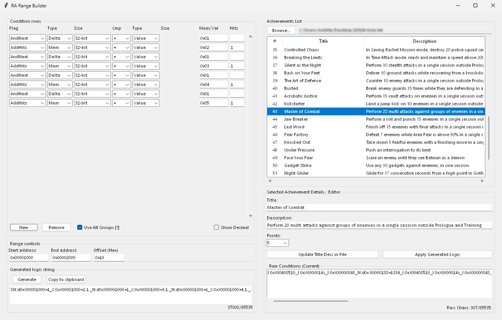

# RA Range Builder

A GUI tool to generate ranged logic strings for RetroAchievements.
Especially useful when dealing with repeated memory layouts like **arrays of structures**, and building conditions without manually adding each one.

---

## Features

- Add/remove **condition rows** via GUI
- Specify **start address, end address, and offsets**
- Automatically generate **compatible RetroAchievements logic strings** with Alt Groups support
- Load **local achievement files** `*-User.txt` found inside `RACache/Data` and apply generated logic directly<br>
<sub>reset achievements in the Assets list within **RAInt** for changes to take effect</sub>
- Real-time monitoring of loaded files for changes



---

## Prerequisites

Before running the app, make sure you have the following installed:

- **Python 3.10+** to run the app from source
- **Git** for cloning the repository
- **Git Bash** (or another terminal) recommended for running commands on Windows
- **PyInstaller** (optional) only if you want to build a standalone `.exe`

---

## Testing

Clone the repository, enter the folder, and run the app:

cd into your folder and run:

```bash
git clone https://github.com/AshMetalRaf/RARangeBuilder.git
```
```bash
cd RA-Range-Builder
```
```bash
python main.py
```

---

## Build Executable (.exe)

(Optional, only if you want a standalone `.exe`)

Install PyInstaller and build the executable:

```bash
pip install pyinstaller
```
```bash
pyinstaller --onefile --windowed main.py
```

---

## Development

- Recommended editor: Visual Studio Code (or any Python editor)
- Open the project folder and edit `.py` files
- Run `python main.py` to test changes

---


## Incomplete 


- Some condition types are not fully implemented yet but users can still generate logic strings for standard conditions.
